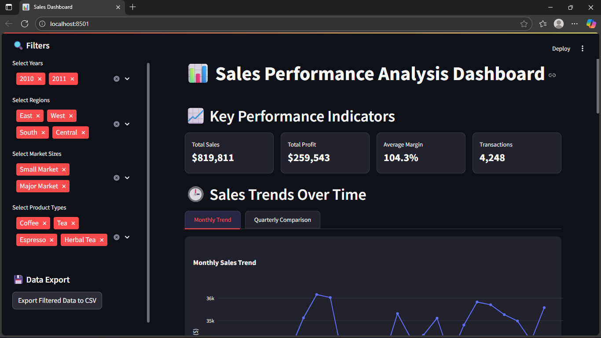
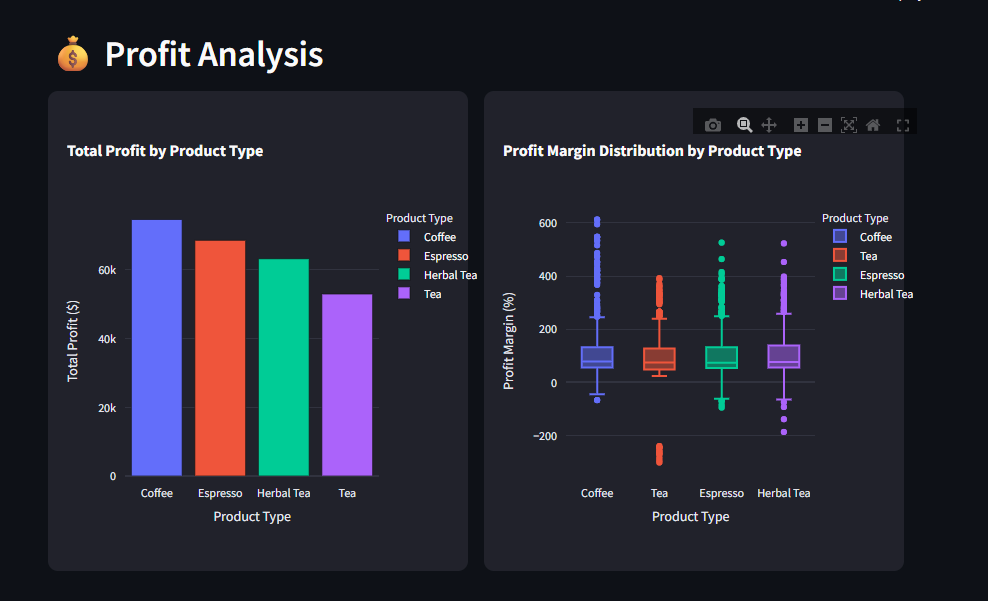

# 📊 InsightSphere: Sales Performance Dashboard  

An interactive **Sales Analytics Dashboard** built with **Streamlit, Pandas, and Plotly**.  
This dashboard provides deep insights into **sales, profits, regions, products, and trends** with a professional **dark-themed UI**.  

---

## ✨ Features  

- 📈 **Key Performance Indicators (KPIs)** – Total Sales, Total Profit, Avg Margin, Transactions  
- 🕒 **Time Analysis** – Monthly & Quarterly sales trends  
- 💰 **Profit Analysis** – Profit by product type & margin distribution  
- 🌎 **Regional Insights** – Sales distribution by region & profit by market size  
- 🏆 **Top & Bottom Products** – Quickly identify best and worst performers  
- 🔍 **Dynamic Filters** – Year, Region, Market Size, Product Type  
- 💾 **Data Export** – Export filtered dataset as CSV  
- 🎨 **Custom Dark Theme** – Professional UI with CSS styling  

---

## 🛠️ Tech Stack  

- [Streamlit](https://streamlit.io/)  
- [Pandas](https://pandas.pydata.org/)  
- [Plotly Express](https://plotly.com/python/plotly-express/)  
- Matplotlib & Seaborn  

---

## 📸 Screenshots  

### Dashboard Overview  
  

## Profit Analysis overview
  

## Regional Performance
  

##Top & Buttom Performance
  


## ⚡ Installation & Usage  

1. **Clone this repository**  
   ```bash
   git clone https://github.com/your-username/insightsphere-dashboard.git
   cd insightsphere-dashboard
